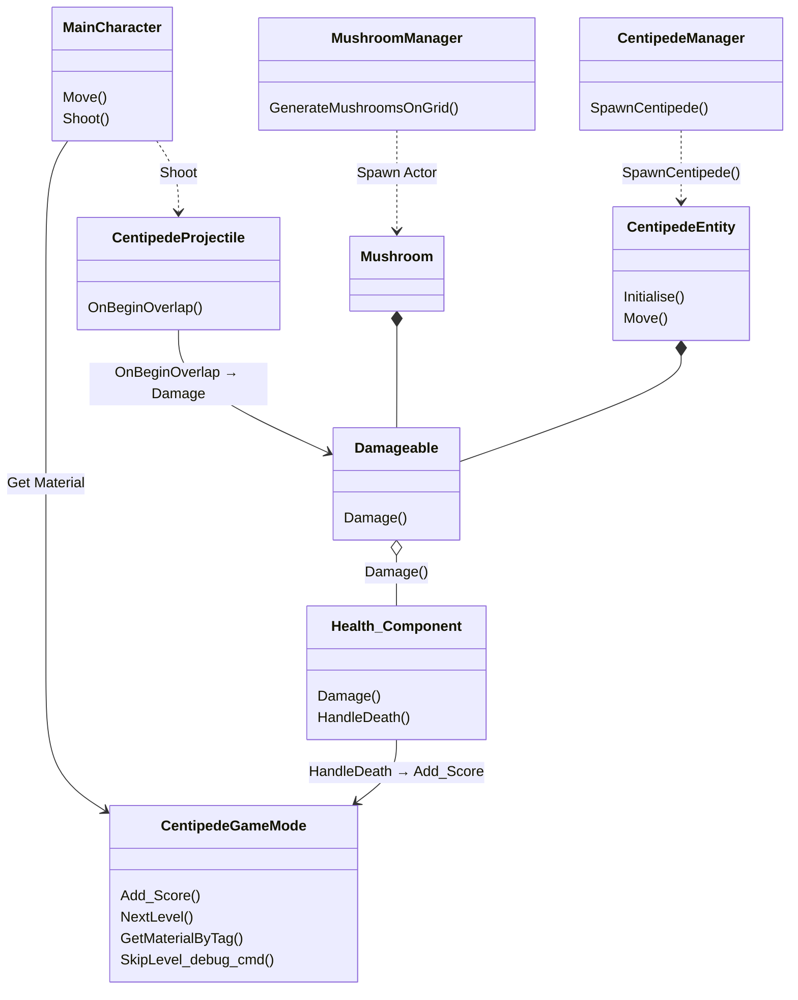

# Centipede Game Architecture



# Centipede Game FileTree
```
Private/
├── Camera/
│   └── CentipedeCamera.cpp
├── Centipede/
│   ├── CentipedeEntity.cpp
│   ├── CentipedeManager.cpp
│   └── CentipedeSegment.cpp
├── Component/
│   ├── CentipedeMovementComponent.cpp
│   └── Health_Component.cpp
├── Core/
│   ├── CentipedeGameInstance.cpp
│   ├── CentipedeGameMode.cpp
│   ├── CentipedeHUD.cpp
│   └── CentipedePlayerController.cpp
├── DataAsset/
│   └── CentipedColorDA.cpp
├── Function/
│   └── CentipedeColorFunctions.cpp
├── Grid/
│   └── CentipedeGridGenerator.cpp
├── Log/
│   ├── CentipedeLogger.cpp
│   └── CentipedeLoggerCategories.cpp
├── MainCharacter/
│   └── MainCharacter.cpp
├── Mushrooms/
│   ├── Mushrooms.cpp
│   └── MushroomsManager.cpp
├── Parent/
│   └── Damageable.cpp
└── Projectile/
    └── CentipedeProjectile.cpp
```